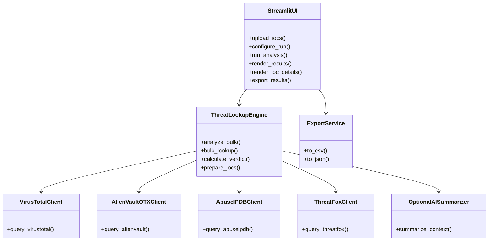
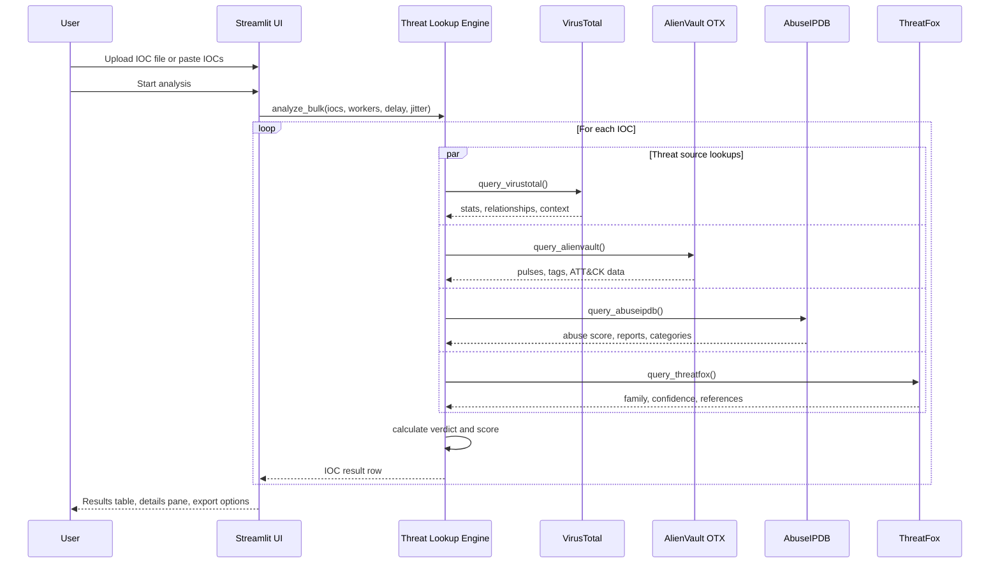
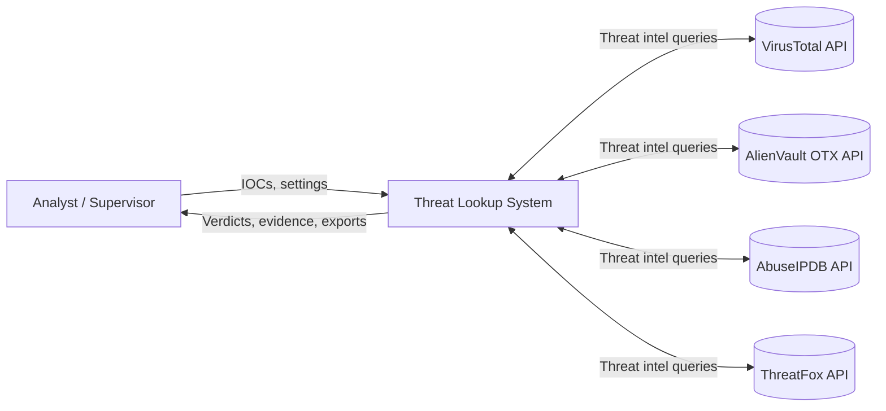
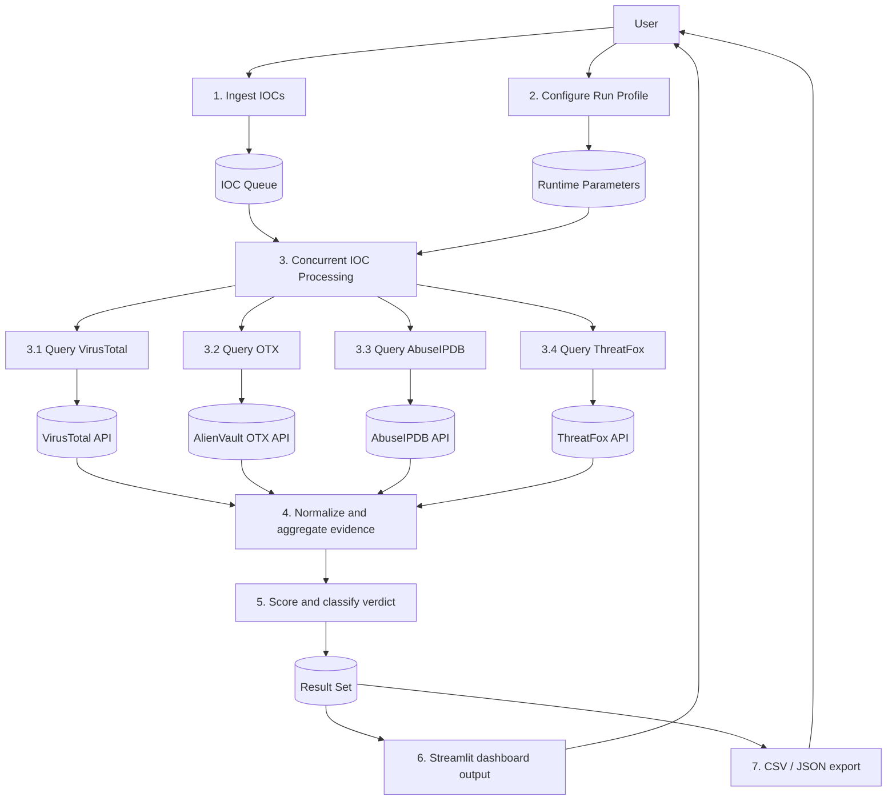

# Threat Lookup UML and DFD

This document captures the current architecture of the Threat Lookup project and the Streamlit UI improvements.

## 1. UML Component View

## 2. UML Sequence View

## 3. Data Flow Diagram

### Level 0

### Level 1

## 4. Notes

- `threat_lookup.py` is the core engine and scoring layer.
- `app.py` is the Streamlit dashboard and presentation layer.
- `run_gui.py` is the Windows-friendly launcher for the dashboard.
- `threat_lookup_final/` contains the curated handoff package for your supervisor.